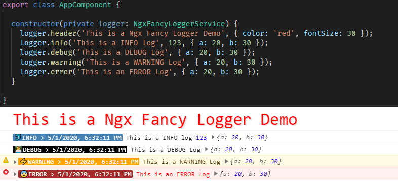

# ngx-fancy-logger

ngx-fancy-logger is a console logger for angular applications. It provides various features like different log levels, display labels, show time etc. 

# [Read Detailed Documentation](./projects/ngx-fancy-logger/README.md) | [NgxFancyLogger HomePage / Demo](https://ngx-fancy-logger.netlify.app/) 

## Key Features

- Different Log Levels (DEBUG=0, INFO=1, WARNING=2, ERROR=3).
- Log Levels are displayed in Label form with assigned color style or default colors.
- Show/Hide Time
- Show/Hide Emoji for each Log Level
- Show Header on console (`color` and `fontSize` configurable)
- Debug RxJS Observable Stream using `debugOperator()` operator function  
- Can configure each setting with `LoggerConfig` in `forRoot` (which allows us to configure `environment` specific configuration) or using `updateConfig()` method.
- Reset configuration using `resetConfig()` method
- Environment Specific Log Level Restriction.
    eg. if you set `logLevel` to `WARNING`, it will only show logs for `WARNING` and `ERROR`. 
- Can configure Log Level Colors.
- Can Disable all logs

## Sample Usage Screenshots

### Header and Different Log Level Sample Logs

### Debug RxJS Observable Stream using `debugOperator()` operator function 
 operator function")

## Demo 
[Ngx-Fancy-Logger Demo with All available configuration options](https://ngx-fancy-logger.netlify.app/#/demo)

## Contribute
All are welcome to contribute to `NgxFancyLogger`. Contribute with some code, file a bug or improve the documentation.

## Contributors ✨✨✨

Thanks goes to these wonderful people.

<!-- ALL-CONTRIBUTORS-LIST:START - Do not remove or modify this section -->
<!-- prettier-ignore-start -->
<!-- markdownlint-disable -->
<table>
  <tr>
    <td align="center">
    
     
    <b>Ankit Prajapati</b>
    </td>
    <td align="center">
    
     
    <b>Jiten (Jits) Bhagat</b>
    </td>
  </tr>
</table>

<!-- markdownlint-enable -->
<!-- prettier-ignore-end -->
<!-- ALL-CONTRIBUTORS-LIST:END -->

## Mark a Star ⭐
If you like this library, **mark a star** ⭐ on [ngx-fancy-logger GitHub](https://github.com/ngdevelop-tech/ngx-fancy-logger) repository, this will increase our confidence to add new features in this library.